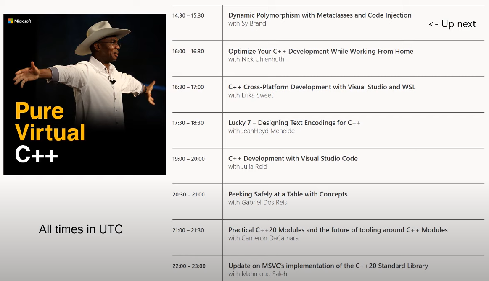
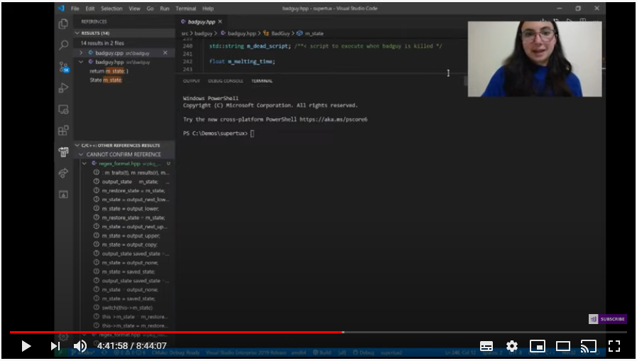

## Microsoft Pure Virtual C++ 2020
https://visualstudio.microsoft.com/pure-virtual-cpp-event
https://www.youtube.com/watch?v=c1ThUFISDF4



richard@shepherd.ws

---

## Dynamic Polymorphism with Metaclasses and Code Injection
|Sy Brand<br>youtube.com/watch?v=drt3yXI-fqk
--- | ---

```cpp
struct Animal { virtual void speak();};
struct Cat: Animal { void speak() override;}
struct Dog: Animal { void speak() override;}
```

Problems with inheritance:
- dynamic allocation, nullability, intrusive, lack of value semantics, difficulties with algorithms and containers

---

```cpp
vector<Animal> animals_by_value;
vector<unique_ptr<Animal>> animals_by_reference;
```

Type erasure
```cpp
struct Animal { void* obj; VTable* vtable; void speak() { vtable->speak(obj);}};
struct Cat { void speak();}
struct Dog { void speak();}

main() {
    Animal a = Cat{};
    a.speak();
    a = Dog{};
    a.speak();
}
```
Wordy boiler plate for wrappers

---

### Reflection - papers, standards proposals
```cpp
template <Enum T>
constexpr std::string to_string(T value) {
  for constexpr (auto e: std::meta::members_of(reflexpr(T)) {
      if (exprid(e) == value) {
          return std::meta::name_of(e);
      }
  }
  return "<unnamed>";
}
```
- not enough

---

### Next step: Code injection - standard proposal?
```cpp
class Point {
    int x; int y;

    consteval {
        for (auto member: meta::mebers_of(reflexpr(Point)) {
            if (meta::is_nonstatic_data_member(member)) {
                -> __fragment struct {
                    typename(meta::type_of(member)) const&
                    unqualid("get_", member)() {
                        return exprid(member);
```

---

Use injections to encapsulate the boilerplate:
```cpp
template <class Facade>
struct typeclass_for {
    void* concrerte_;
    vtable<Facade> const* vtable_;
    // constructors, forwarding functions etc.
};
struct Animal_facade {
    void speak();
};
using Animal = typeclass for <Animal_facade>;
```
Could include policies to specialize memory management and function locality.

---

Metaclass proposal would streamline this further:
```cpp
class(typeclass) Animal {
    void speak();
};
std::vector<Animal> animals;
```

### Concerns
- Performance: run time and compile time
- Availability
- Inconsistent with Concepts (structure rather than intent)

---

## Optimize Your C++ Development While Working From Home
|Nick Uhlenhuth<br>youtube.com/watch?v=JplnRSDa29w
--- | ---

Challenges: Compute, Collaboration, Communication

---

### Compute: Limited laptop

#### Incredibuild extension
Free upto 8 cores, visualization to understand build bottlenecks

#### Visual Studio Online
  - Connect from local VS2019 to Online environments - based on repo
  - Costs? Mention of pay-for-what you use. Uses Azure credits (that come with your licence)
  - Local VS is just rendering client - build, dialog content all online
  - Debugging: interactive console window runs online, LiveShared
  - Use browser to access online environments
    - Manage environment settings
    - Browser based IDE - similar to VSC
    - Shareable environment

---


---

### Collaboration
#### Live Share
- Host has source code locally. Guests don't need
- Share via auto-generated link.
- Pair programming, code interviews
- Following, seeing cast app from host
- Guest can share from the browser
- `Insiders` setting in Visual Studio

---


---

### Communication
Teams: Office365 and also currently Free!

Online `MS Build` conference in May 19-21

---

## C++ Cross-Platform Development with Visual Studio and WSL
|Erika Sweet<br>youtube.com/watch?v=ijmZKRIfoOI
--- | ---

WSL - Windows Subsystem for Linux *(not discussed in detail)*
- vs2017 support for dev c/c++ remote linux systems over ssh
- vs2019 native support for WSL
- lets you run a linux environment on Windows
- one copy of source shared by both rather than copied over ssh
- *(can't be shared from linux filesystem yet)*

---

CMake - open source, cross-platform build system
- first class support in VS
- build on local Windows, local WSL-GCC or remotely
- intellisense enabled
- for Windows, ms cl or clang can be used
- CMake not vital - can also use MS Build projects

---

Debugging: VS front-end onto gdb, including condition and trace breakpoints
- AddressSanitzer integrated for Linux *(available for Windows x86 builds too)*
- via MIEngine (open source) can use gdb directly
- Can build locally, but deploy and debug on remote (e.g. local docker linux installation)
- Platform intellisense informs you of code issues that apply to some configurations e.g. `#include <windows.h>`

btw: `vcpkg` is a c/c++ package manager for Windows, Linux and MacOS
- can be integrated into VS so that package tips are offered

---

## Lucky 7 – Designing Text Encodings for C++
|JeanHeyd Meneide<br>youtube.com/watch?v=w4qYf2pvPg4
--- | ---

- `char` is bad because you don't know the encoding (e.g. part of utf8 or windows1252 or..?)
- leads to wrong assumptions
- `wchar_t` is bad: utf16 or utf32 or variants (ECS2) for different platforms or libraries, or completely different in other locales (Chinese, Japan etc)
- `char16_t` and `char32_t` bad. Only known if `__STD_C_UTF_16__` or `32` defined, else ..?
- `C++20` fixes this. `char16_t` and `char32_t` now always have the expected expected

---

Proposed API for standardization for handling text in c++

Standard support for Unicode? - effectively none or a nightmare of individual libraries

Just do it: `char` -> `utf8`?
Problems:
- signed
- mixed use: encoding and utf8. Environments make the wrong choice; can't be fully controlled (for most companies)

---

Encoding_object (`Lucky 7`):
- 3 type definitions (`code_point`, `code_unit`, `state`)
- 2 static member variables (`max_code_points`,`max_code_units`)
- 2 function (`encode_one`, `decode_one`)

Sufficient to describe all encoding/decoding scenarios
- except stepping backwards
- minimal abstraction

---

Standard encodings for c++23: e.g. ascii, narrow/wide_execution/literal, utf8, utf16, ..
c++23/26: Entire WHATWG Suite of Encodings
Make your own using this abstraction

Demonstrate Encoding object use with Transcoding and Validation:
- Transcoding: Encoding A to Encode B, via common `code_point` (99.99% utf32)
  - composable Encoding objects
- Validation: round trip decoding/encoding to check no errors and identical
  - could use Transcode (wasteful but consistent)
- Counting: 

Standard proposal includes: `encode`, `encode_into`, `transcode` etc
- all `constexpr` so can be used for `static_assert` that compiler's implementation can support encoding
- just needs your Encoding object with these 7 features (bonuses for more)

---

## C++ Development with Visual Studio Code
|Julia Reid<br>youtube.com/watch?v=bK882S9ESpo
--- | ---

VSCode: Light-weight editor -> Full IDE
C++ extension: Intellisense, Build/Debug, CMake support (help finding compilers and toolkits)
- Find all references, Rename, Peek etc
- Commands presented on the Blue status bar as well as Ctrl-Shift-P command palette
- Debug panes, breakpoints

---



---

Remote development extensions: Ssh, Containers, WSL, LiveShare
- via ssh you can use local VSC against remote source and compiler

Cross-platform dev: windows, linux, macos
vcpkg: c++ package management: 1300 libraries, routinely tested against each other for compatibility
- coming soon: understanding project dependencies via manifest file, versioning, private libraries

---

## Peeking Safely at a Table with Concepts
|Gabriel Dos Reis<br>youtube.com/watch?v=c1ThUFISDF4
--- | ---

Shift verification burden from runtime to compiletime

`Concept` is a predicate over types and compile-time values, allowing code to express intent (more clearly than SFINAE)

---

e.g.
```cpp
#include <concepts>

template<std::unsigned_integral T>
constexpr int length(T t) { .. }

int main() {
    auto a = length(47834u); //ok
    auto b = length(935.4);  //FAIL
    auto c = length(-47834)l //FAIL
}
```

---

How to create Concept?
- constexpr function to provide predicate
- c++14: use static_assert on the data items (not the usage point)
- now, define `concept` instead e.g.
```cpp
template<int N>
constexpr bool retractible_by_key(const Play (&table)[N]) { .. }

template<auto& table>
concept RetractableByKey = retractible_by_value(table);

template<auto& table> requires RetractibleByKey<table>
inline auto& play_entry(Action act) {
    return table[bits::rep(act)];
}
```
---
Lots of questions raised:
- can we have overloads that obey different constraints or none?
- could we have version that checks at runtime for runtime structures?

---

## Practical C++20 Modules and the future of tooling around C++ Modules
|Cameron DaCamara<br>youtube.com/watch?v=ow2zV0Udd9M
--- | ---

C++20 Exported Translation Units
- Module Units:
  - Primary Module Interfaces:
  - Module Partitions
- Header Units: 

---

### Primary Module Interfaces
```cpp
export module m;
export struct MyType {};
struct InternalType {};
export f(MyType) { InternalType i; ..}
```
```cpp
import m;
int main() {
    MyType type;
    f(type);
}
```
---
### Module Partitions
Separate up the Primary Module INterfaces into different files to simplify builds and clarify parts e.g. types vs functions vs convenient bundle.
#### m-types.ixx
```cpp
export module m:types;
export struct MyType {};
struct InternalType {};
```

---

#### m-functions.ixx
```cpp
export module m:functions;
import :types;
export f(MyType) { InternalType i; ..}
```
### m.ixx
```cpp
export module m;
export import :types;
export import :functions;
```

---
### Header Units
Separately compiled header files: formalized pch
```cpp
import <m.h>;
int main() {
    MyType type;
    f(type);
}
```
---
Increasing difficulty of integration:
1. Current headers translate relatively  easily to header units
2. Primary Module Interfaces
3. Module Partitions

Notes from demo:
- build module version of headers separately, reduces build of `main` (/10 in imgui demo)
- mention that Microsoft uses a by-reference module mechanism so that modules are dynamically loaded at runtime - suggesting that this isn't necessary or mandated.
- suggestion that the build order for modules needs to be manually maintained
- MS's modules on disk conform to IFC specification (derived from IPR) which, for instance matches python modules; and open source, so tooling opportunities

---

## Update on MSVC’s implementation of the C++20 Standard Library

|Mahmoud Saleh<br>youtube.com/watch?v=ArW8n0QBdiE
--- | ---

- 2019: completed implementation of all of c++17
- open source the MS STL implementation on Github
  - cleaned code and make files
  - gives faster integration and accepts contributions (e.g. vs2019 16.5)
  - lower level VS runtime and Universal runtime not open source

---

- to come:
  - migrate bugs to github, complete CMake migration, finish c++20
- licensing: same as LLVM; pretty open, but restricts contributions
  - distributed binaries don't need to attribute, but sourcecode would
- progress: 30% of c++20 features remaining - aim for early 2021

---

Last C++17 addition:
- elementary string conversions: `from_chars`, `to_chars`, non-throwing, locale-independent, 10x speed up; supports bases, formatting & precision

---

Recent C++20 highlights:
- `contains` for associative containers, including heterogenous keys
- `starts_with`, `ends_with` for `string` and `string_view`
- `char8_t`, and `u8string`, `u8stream`. Devs still need to write helpers to actually output
  - can be used with filesystem (`u8path` deprecated)
- `erase` and `erase_if`, less error-prone than `remove`, `remove_if`, by taking whole container
- `is_constant_evaluated`
- add `constexpr` to `<algorithm>` and `<utility>` e.g. `find`, `is_sorted`, `equal`, `replace`
- `span`
- `ranges` (required `concepts`). `ranges::algorithms` is done, but not everything else

---

https://visualstudio.microsoft.com/pure-virtual-cpp-event
https://www.youtube.com/watch?v=c1ThUFISDF4
https://github.com/rshepherd549/docs/tree/master/talk_pure_virtual
